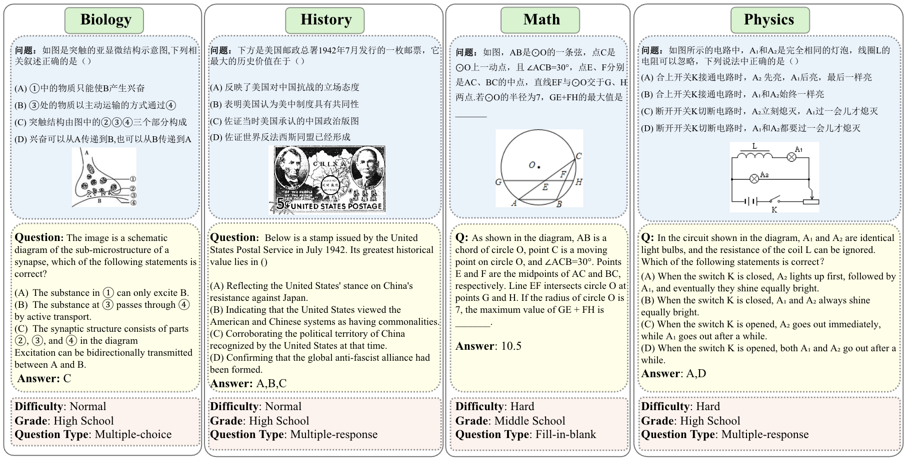

# CMMU
[**📖 Paper**](assets/cmmu.pdf) | [**🤗 Dataset**](https://huggingface.co/datasets/BAAI/CMMU) | [**GitHub**](https://github.com/FlagOpen/CMMU)

This repo contains the evaluation code for the paper [**CMMU: A Benchmark for Chinese Multi-modal Multi-type Question Understanding and Reasoning**](assets/cmmu.pdf) .

We release the validation set of CMMU, you can download it from [here](https://huggingface.co/datasets/BAAI/CMMU). The test set will be hosted on the [flageval platform](https://flageval.baai.ac.cn/). Users can test by uploading their models.

## Introduction
CMMU is a novel multi-modal benchmark designed to evaluate domain-specific knowledge across seven foundational subjects: math, biology, physics, chemistry, geography, politics, and history. It comprises 3603 questions, incorporating text and images, drawn from a range of Chinese exams. Spanning primary to high school levels, CMMU offers a thorough evaluation of model capabilities across different educational stages.
  

## Evaluation Results
We currently evaluated 10 models on CMMU. The results are shown in the following table.

| Model                       | Val Avg. | Test Avg. |
|-----------------------------|----------|-----------|
| InstructBLIP-13b            | 0.39     | 0.48      |
| CogVLM-7b                   | 5.55     | 4.9       |
| ShareGPT4V-7b               | 7.95     | 7.63      |
| mPLUG-Owl2-7b               | 8.69     | 8.58      |
| LLava-1.5-13b               | 11.36    | 11.96     |
| Qwen-VL-Chat-7b             | 11.71    | 12.14     |
| Intern-XComposer-7b         | 17.87    | 18.42     |
| Gemini-Pro                  | 21.58    | 22.5      |
| Qwen-VL-Plus                | 27.51    | 27.73     |
| GPT-4V                      | 30.19    | 30.91     |

## How to use

### Load dataset
```python
from eval.cmmu_dataset import CmmuDataset
# CmmuDataset will load *.jsonl files in data_root
dataset = CmmuDataset(data_root=your_path_to_cmmu_dataset)
```

**About fill-in-the-blank questions**

For fill-in-the-blank questions, `CmmuDataset` will generate new questions by `sub_question`, for example:

The original question is:
```python
{
    "type": "fill-in-the-blank",
    "question_info": "question", 
    "id": "subject_1234", 
    "sub_questions": ["sub_question_0", "sub_question_1"],
    "answer": ["answer_0", "answer_1"]
}
```
Converted questions are:
```python
[
{
    "type": "fill-in-the-blank",
    "question_info": "question" + "sub_question_0", 
    "id": "subject_1234-0",
    "answer": "answer_0"
},
{
    "type": "fill-in-the-blank",
    "question_info": "question" + "sub_question_1", 
    "id": "subject_1234-1",
    "answer": "answer_1"
}
]
```

**About ShiftCheck**

The parameter `shift_check` is `True` by default, you can get more information about `shift_check` in our technical report.

`CmmuDataset` will generate k new questions by `shift_check`, their ids are `{original_id}-k`.


## Evaluate

The output format should be a list of json dictionaries, the required key is as follows:
```python
{
    "question_id": "question id",
    "answer": "answer"
}
``` 

[Here](example/gpt4v_results_val.json) is result generated by GPT-4.

Current code call gpt4 API by `AzureOpenAI`, maybe you need to modify [`eval/chat_llm.py`](eval/chat_llm.py)  to create your own client, and before run evaluation, you need to set environment variables like `AZURE_OPENAI_API_KEY` and `AZURE_OPENAI_ENDPOINT`.

Run 
```shell
python eval/evaluate.py --result your_pred_file --data_root your_path_to_cmmu_dataset
```

**NOTE:** We evaluate fill-in-the-blank questions using GPT-4 by default. If you do not have access to GPT-4, you can attempt to use a rule-based method to fill in the blanks. However, be aware that the results might differ from the official ones.
```shell
python eval/evaluate.py --result your_pred_file --data_root your_path_to_cmmu_dataset --gpt none
```

To evaluate specific type of questions, you can use `--qtype` parameter, for example:
```shell
python eval/evaluate.py --result example/gpt4v_results_val.json --data_root your_path_to_cmmu_dataset --qtype fbq mrq
```

## Citation
**BibTeX:**
```bibtex
@article{he2024cmmu,
        title={CMMU: A Benchmark for Chinese Multi-modal Multi-type Question Understanding and Reasoning},
        author={Zheqi He, Xinya Wu, Pengfei Zhou, Richeng Xuan, Guang Liu, Xi Yang, Qiannan Zhu and Hua Huang},
        journal={arXiv preprint},
        year={2024},
      }
```